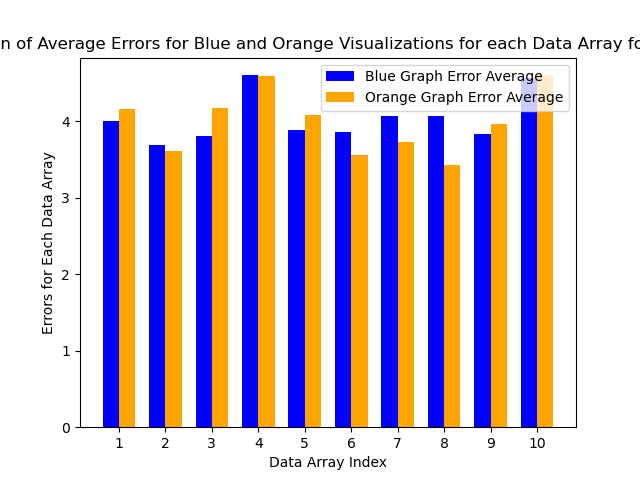

# finalProject-yakovenko-kittur-stjean

Website: https://sites.google.com/view/cs4804yakovenko-kittur-stjean/home

Our website has our process book, visualization, screen-cast, and data.

The visualizations used in our experiments were adapted from the ones we used in A3, which use d3. The experiments themselves were implemented with the SurveyJS library.

Contributions:

Taya:

Ash: Made donut charts, created visualizations from donut charts

Myles: Made radar charts, implemented surveys for each type + stored results, distributed radar experiment, made website, recorded screen-cast.

# Overview and Motivation
Implement three different surveys, each with one visualization type.
To decrease the effort required of the participants to possibly decrease fatigue and improve the consistency of results.
Surveys were designed using SurveyJS library + React and deployed via GitHub pages
In each survey, feature 10 pairs of visualizations, with one from each pair being “low-contrast” and the other “high-contrast”.
To assess the impact of color contrast on participants’ ability to estimate numeric differences.
VIsualizations were created with d3.

# Related Work: 

Previous assignment A3 (+ Cleveland/McGill), discussions with Professor Harrison, lecture topics

# Hypothesis 
In this extension of the experiment given in A3 we aim to answer the three questions below:
- How does visualization type affect participants’ ability to estimate numeric differences?
- How does color contrast affect participants’ ability to estimate numeric differences?
- How does survey length affect participants’ ability to estimate numeric differences?

# Data Collection and Evaluation
The data was collected by each of the group members separately for each visualization type. More specifically, we created three seperate pages with corresponding QR codes to surveys for bar, radar, and donut visualizations. In contrast to A3, each survey contained only 20 questions: the first 10 related to low contrast charts and the last 10 related to high contrast charts for each visualization type. The participants were able to take the survey on their phone or computer for convenience. 

Each of the 10 graphs represented the same set of 10 arrays for consistency in comparing the results. The data was evaluates in a similar manner to A3 with the addition of calculations to compare the average errors for high and low contrast visualizations

Below are some examples of high and low contrast charts provided on the three types of surveys.

# Evaluation
## Bar Chart
The average error for high contrast bar charts based on the standard deviation of each dataset:

The average error for low contrast bar charts based on the standard deviation of each dataset:

Error comparison between high and low contrast for each data array:

## Radar Chart
The average error for high contrast radar charts based on the standard deviation of each dataset:

The average error for low contrast radar charts based on the standard deviation of each dataset:

Error comparison between high and low contrast for each data array:

## Donut Chart
The average error for high contrast donut charts based on the standard deviation of each dataset:

The average error for low contrast donut charts based on the standard deviation of each dataset:

Error comparison between high and low contrast for each data array:

## Donut Chart Achievements
The generator code was designed to work with several inputs at once, allowing for ease-of-access.
The first two values will always be painted red in the visualization, regardless of their position, allowing for increased visual clarity.

## Credits

Donut Chart:
* d3.js https://d3js.org/
* CSS/HTML
