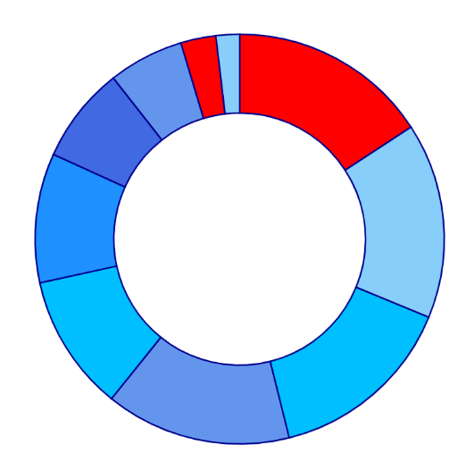
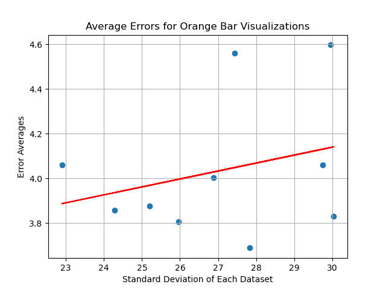
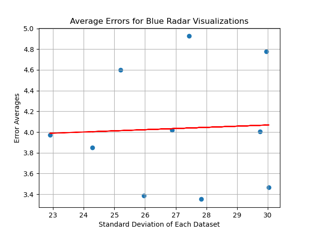
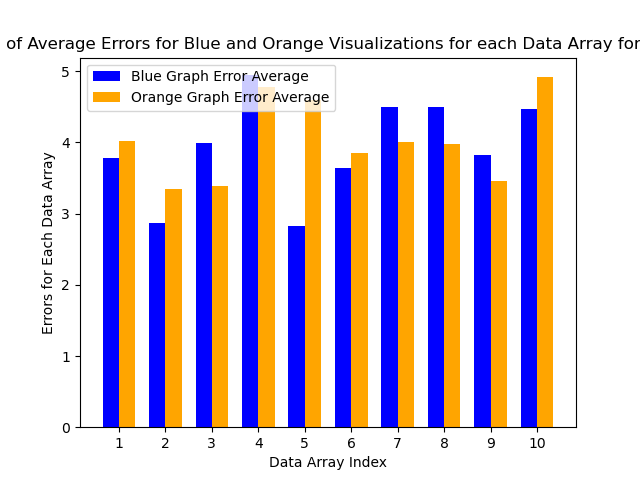

Website: https://sites.google.com/view/cs4804yakovenko-kittur-stjean/home

Our website has our process book, visualization, screen-cast, and data.

The visualizations used in our experiments were adapted from the ones we used in A3, which use d3. The experiments themselves were implemented with the SurveyJS library.

# Overview and Motivation
Implement three different surveys, each with one visualization type.
To decrease the effort required of the participants to possibly decrease fatigue and improve the consistency of results.
Surveys were designed using SurveyJS library + React and deployed via GitHub pages
In each survey, feature 10 pairs of visualizations, with one from each pair being “low-contrast” and the other “high-contrast”.
To assess the impact of color contrast on participants’ ability to estimate numeric differences.
VIsualizations were created with d3.

# Related Work: 

Previous assignment A3 (+ Cleveland/McGill), discussions with Professor Harrison, lecture topics

# Hypothesis 
In this extension of the experiment given in A3 we aim to answer the three questions below:
- How does visualization type affect participants’ ability to estimate numeric differences?
- How does color contrast affect participants’ ability to estimate numeric differences?
- How does survey length affect participants’ ability to estimate numeric differences?

# Data Collection and Evaluation
The data was collected by each of the group members separately for each visualization type. More specifically, we created three seperate pages with corresponding QR codes to surverys for bar, radar, and donut visualizations. In contrast to A3, each survey contained only 20 questions: the first 10 related to low contrast charts and the last 10 related to high contrast charts for each visualization type. The participants were able to take the survey on their phone or computer for convenience. 

Each of the 10 graphs represented the same set of 10 arrays for consistency in comparing the results. The data was evaluates in a similar manner to A3 with the addition of calculations to compare the average errors for high and low contrast visualizations

Below are some examples of high and low contrast charts provided on the three types of surveys.
### Low Contrast Bar Chart

### High Contrast Bar Chart

### Low Contrast Radar Chart

### High Contrast Radar Chart

### Low Contrast Donut Chart
 
### High Contrast Donut Chart

# Evaluation
## Bar Chart
The average error for high contrast bar charts based on the standard deviation of each dataset:

The average error for the high contrast bar chart was 3.9888914098102553.

The average error for low contrast bar charts based on the standard deviation of each dataset:

The average error for the low contrast bar charts was 4.033975418651378.

Error comparison between high and low contrast for each data array:

Notice that the average error for the high contrast charts was similar to that of average error for the low contrast chart. Moreover, high contrast chart had stronger correlation with standard deviation. Contrary to the hypothesis, the overall error with low contrast charts seems to be lower.

## Radar Chart
The average error for high contrast radar charts based on the standard deviation of each dataset:

The average error for the high contrast charts was 4.034301439723086.

The average error for low contrast radar charts based on the standard deviation of each dataset:

The average error for the low contrast charts was 3.935321847641552.

Error comparison between high and low contrast for each data array:

Notice that the high contrast radar charts had lower correlation with the standard deviation than the low contrast radar charts. However, the overall errors seem to be similar and very close with the bar charts above. 

## Donut Chart
The average error for high contrast donut charts based on the standard deviation of each dataset:

The average error for high contrast donut charts was 4.377846506419004.

The average error for low contrast donut charts based on the standard deviation of each dataset:

The average error for the low contrast donut charts was 4.489632010051756.

Error comparison between high and low contrast for each data array:

Notice that the high contrast donut charts had lower errors but high correlation with the standard deviation when compared to the low contrast charts. Overall, the errors were similar for both as shown for the other chart types above. 

# Conclusion
## Sources of Error
Some of the potential sources of error include showing low contrast charts before the high contrast charts. Since the users saw the same data for both, it might have been easier to determine the difference for the high contrast charts on the second page of the survey. 
Another potential source of error could've come from the fact that some participants took the survey on their phones vs. computer. The UI for a phone was a bit harder to use making it harder for participants to accurately calculate the errors. 
Finally, including the scales for each graph might have made it easier for participants to calculate the exact numerical differences. 
## Reflection
Overall, we saw that the errors were relatively high with similar values for high and low contrast charts. However, the overall errors for bar charts were the lowest establishing that the bar charts are the best way to represent simple numeric data followed closely by radar charts. Notice that the low contrast errors were very similar to those of high contrast charts suggesting that the colour of visualization does not have a great impact on user perception. Shorter surverys did not result in lower errors for bar and radar charts when compared to A3 results. However, errors for donut charts are noticibly lower when compared to A3. Finally, simplifying the question for each visualization did not have significant impact on the errors. 

# Technical and Design Achievements
## Technical
- statistical analysis
- three separate surveys for each visualization type

# Credits 
Taya - analysis and analysis report; code for bar charts and visualization generation; bar charts survey data collection

Myles - Made radar charts, implemented surveys for each type + stored results, distributed radar experiment, made website, recorded screen-cast.

Ash -
